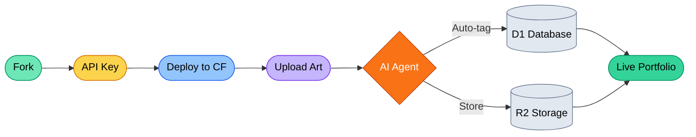

# AIGC Portfolio

**Upload your art. Let AI handle the rest. Pay nothing.**

**[English](./README.md) | [中文说明](./README_ZH.md) | [日本語の説明](./README_JA.md)**

---


A production-ready AI art gallery and blog. 9 dependencies. Zero vendor lock-in. Runs entirely on Cloudflare's free tier.

> [!IMPORTANT]
> **No coding required.** Fork the repo, follow the [Deployment Guide](./src/QuickStart/DEPLOY_WITH_AI.md), and have your site live in minutes. Or use `bash setup.sh` for a one-command deploy.

---

## What This Does

- **Gallery** — Upload artwork, AI auto-tags and describes it using vision models
- **Blog** — Markdown editor with AI copywriting assistance
- **Multi-LLM orchestration** — Switch between Cloudflare Workers AI, NVIDIA NIM, and Google Gemini from the dashboard. No middleware, no SDKs — direct API calls routed by string prefix
- **Butler** — Context-aware AI assistant that knows your site's content and state
- **Admin panel** — Full CMS with site config, AI settings, content audit, usage monitoring
- **Agentic development** — Ships with `.claude/` and `.antigravity/` context files so AI coding tools understand the project from the first prompt

---

## Workflow



---

## Three Ways to Use It

<details>
<summary><b>Layer 1: Deploy with AI (zero code)</b></summary>

Fork → paste the prompt from [DEPLOY_WITH_AI.md](./src/QuickStart/DEPLOY_WITH_AI.md) into Claude Code or Antigravity → your site is live.

</details>

<details>
<summary><b>Layer 2: Customize via Admin Panel</b></summary>

- Switch AI providers and models from the dashboard
- Edit system prompts to change how AI describes your art
- Configure hero, navigation, metadata
- Protect `/admin` with Cloudflare Zero Trust

See [SETUP.md](./src/QuickStart/SETUP-en.md) for full configuration guide.

</details>

<details>
<summary><b>Layer 3: Build with AI Coding Tools</b></summary>

This repo ships with agentic context files:

- **`.claude/CLAUDE.md`** — Run `claude` in the root. The agent understands the architecture, constraints, and patterns instantly.
- **`.antigravity/rules.md`** — Gemini and other AI tools read this for project context.

Adding a new AI provider is ~80 lines. Adding a new admin page follows established patterns. The codebase is intentionally readable — 200-line file cap, zero React, pure Astro components.

</details>

---

## Tech Stack

| Layer | Technology |
| :--- | :--- |
| **Framework** | Astro 5 (SSR) |
| **Runtime** | Cloudflare Workers (edge) |
| **Database** | Cloudflare D1 (serverless SQLite) |
| **Storage** | Cloudflare R2 (S3-compatible) |
| **AI** | CF Workers AI + NVIDIA NIM + Google Gemini |
| **Styling** | Tailwind CSS 4 |
| **Dependencies** | 9 total (zero React, zero ORMs, zero AI SDKs) |

---

## Current Release (v1.3.0)

- Full gallery with masonry layout, search, tag/model filtering
- Markdown blog with topics and RSS
- Multi-provider AI: vision analysis, text generation, chat
- Butler chatbot with site context injection
- Admin panel: gallery, blog, pages, AI settings, audit, developer hub
- Smart onboarding checklist (detects actual DB state)
- `setup.sh` one-command deploy
- GitHub Actions CI (auto-deploys when credentials configured)

---

## Quick Start

```bash
# Clone your fork
git clone https://github.com/YOUR_USERNAME/AIGC-portfolio.git
cd AIGC-portfolio

# Automated setup (creates D1, R2, deploys)
bash setup.sh

# Or manual
npm install
npm run dev      # local development
npm run deploy   # build + deploy to Cloudflare
```

See [SETUP.md](./src/QuickStart/SETUP-en.md) for detailed instructions or [how-to-get-free-test-api.md](./src/QuickStart/how-to-get-free-test-api.md) for API key guides.

---

## Usage, Ethics & Regulation

> [!NOTE]
> **Responsible AI Usage:** Free-tier keys are sufficient for testing and personal use. For production, consider paid API tiers for reliability.
>
> **Regional Compliance:** AI regulations (EU AI Act, China's Generative AI Measures, Canada's AIDA) vary by region. As the operator of your fork, you are responsible for transparency, data privacy, and usage accountability.

---

## License

**MIT License** — See [LICENSE](https://github.com/danielw-sudo/AIGC-portfolio?tab=MIT-1-ov-file) for details.

---

**Built with AI agents for the next generation of creators.**
