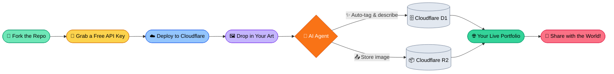

# 🚀 AIGC portofolio

---

## 🌐 Internationalization / 多语言支持 / 多言語対応

**[English](./README.md) | [中文说明](./README_ZH.md) | [日本語の説明](./README_JA.md)**

---

A production-ready, **AI-Agentic** art gallery and blog with an **extreme lightweight structure**. Built with **Astro 5** and powered by the **Cloudflare Ecosystem**.

> [!IMPORTANT]
> **No Coding Required.** This project is designed to build fast agentic workflows without vendor-locked heavy packages. Fast to deploy, easy to use, zero cost to start, and potential to go beyond and above. Fork the repo, follow the [Deployment Guide](./src/QuickStart/DEPLOY_WITH_AI.md), and have your site live in minutes.

---

## 🧭 Project Navigation
* [**🎨 Fast Deployment**] — Launch your site in 5 minutes.
* [**🛠️ Customize your site**] — Configure and customize your AI agents.
* [**💻 Develop new features**] — Scale, modify, and dev with Claude Code & Antigravity.
* [**🔑 Get Free API Keys**](./src/QuickStart/how-to-get-free-test-api.md) — Get started with free-tier keys for all supported AI providers.

---

## 🏗️ Workflow Overview

_Click the titles below to view the sections_

🚀 <b>How to Deploy with AI (0 coding)</b>

### The "No-Code" Path
This workflow is designed for users who want a professional site without touching a terminal or writing code.

1. **Fork this Repo**: Click the "Fork" button at the top right to claim your own copy of the project.
2. **Cloudflare Integration**: Connect your GitHub account to Cloudflare Pages.
3. **Automated Provisioning**: Cloudflare will detect the configuration and automatically set up your database (D1) and image storage (R2).
4. **Go Live**: Your site is now live! Visit your unique URL to start sharing your art.

*See [**DEPLOY_WITH_AI.md**](./src/QuickStart/DEPLOY_WITH_AI.md) for a visual step-by-step guide.*

⚙️ <b>How to Set Up Your Site with AI</b>

### Manage your site and your AI "employees"
If you are comfortable with API keys and settings, you can fine-tune how the AI works for you:

1. **API Selection**: Use the dashboard to toggle between **NVIDIA NIM**, **Google Gemini 3 Flash**, or **Cloudflare Worker AI** for your image analysis.
2. **System Prompting**: Tweak the "Agent Vibe" to change how descriptions are written (e.g., "Professional," "Poetic," or "Detailed Technical").
3. **Zero Trust Security**: Use Cloudflare Access to protect your `/admin` area so only you can manage the content.

*See [**SETUP.md**](./src/QuickStart/SETUP.md) for advanced configuration and [**how-to-get-free-test-api.md**](./src/QuickStart/how-to-get-free-test-api.md) for step-by-step instructions on obtaining free API keys.*

🛠️ <b>How to Build New Features (agentic coding)</b>

### High-Velocity Agentic Development
This repository is a "Clean Slate" pre-configured for **Claude Code** and **Google Antigravity**.

1. **AI-Ready Workspace**: We have included the `.claude/` and `.antigravity/` directories. These contain the context and rules the AI needs to understand the project structure.
2. **Seamless Onboarding**: 
    * **Claude Code**: Run `claude` in the root. The agent will read your `CLAUDE.md` and be ready to refactor or add features instantly.
    * **Antigravity**: Use the `mission_control.json` to manage complex tasks across the Astro 5 codebase.
3. **Optimized for 2026**: Built with Tailwind 4 and Astro 5, utilizing the latest in container queries and CSS-next features.

> [!NOTE]
> `.claude/` and `.antigravity/` folders will be added with the next commit.

---

## 🛠️ The Tech Stack

| Layer | Technology |
| :--- | :--- |
| **Framework** | Astro 5 (SSR) |
| **Runtime** | Cloudflare Workers |
| **Database** | Cloudflare D1 (Serverless SQLite) |
| **Storage** | Cloudflare R2 (S3-compatible) |
| **AI Agents** | NVIDIA NIM + Google Gemini + CF Workers AI |
| **Styling** | Tailwind CSS 4 |

---

## 🗺️ Roadmap Snapshot

**Currently Available (v1.2.0):**
* Full Gallery & Markdown Blog with Cloudflare D1 + R2.
* Zero-Code Automation via `setup.sh`.
* Multi-Provider Vision AI (NVIDIA, Gemini, CF Workers AI).
* Zero Trust Admin Panel.
* Built-in `.antigravity/` AI Handoff for instant agentic coding.

**Coming Soon:**
* Chatbot Setup Assistant (Web-based guided fork + deploy).
* Advanced Gallery filtering and search indexing.
* Deeper image optimization pipelines.

*(See the full [**ROADMAP.md**](./ROADMAP.md) for detailed progress and release history.)*

---

## 🌍 Usage, Ethics & Regulation

> [NOTICE]
> **Responsible AI Usage:** Free-tier keys are sufficient for testing and development — see [**how-to-get-free-test-api.md**](./src/QuickStart/how-to-get-free-test-api.md) for a guide on obtaining them. We recommend transitioning to paid AI model APIs for long-term production use to ensure higher data quality, increased processing capacity, and uninterrupted service.
>
> **Regional Compliance:**
> AI regulations (such as the EU AI Act, China's Generative AI Measures, or Canada's AIDA) vary by region. Please ensure your implementation complies with the local laws and data privacy regulations of your operating jurisdiction. As the operator of your fork, you are responsible for:
> 1. **Transparency:** Disclosing AI-generated content to your visitors.
> 2. **Data Privacy:** Ensuring your use of Vision-AI complies with local privacy laws regarding image metadata.
> 3. **Usage Accountability:** Maintaining responsibility for the accuracy and ethical impact of AI-generated outputs delivered through your platform.

---

## 📜 License

This project is licensed under the **MIT License**. See the [LICENSE](https://github.com/danielw-sudo/AIGC-portfolio?tab=MIT-1-ov-file) for full details.

---
**Crafted with 🤖 AI Agents for the next generation of creators.**

