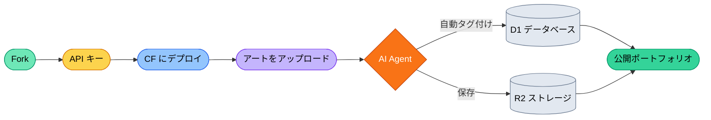

# AIGC Portfolio

**アートをアップロード。AI が残りを処理。コストゼロ。**

**[English](./README.md) | [中文说明](./README_ZH.md) | [日本語の説明](./README_JA.md)**

---


本番対応の AI アートギャラリー＆ブログ。依存関係 9 個。ベンダーロックインなし。Cloudflare の無料枠で完全に動作。

> [!IMPORTANT]
> **コーディング不要。** リポジトリを Fork し、[デプロイガイド](./src/QuickStart/DEPLOY_WITH_AI.md)に従うだけで、数分でサイトを公開できます。または `bash setup.sh` でワンコマンドデプロイ。

---

## 機能概要

- **ギャラリー** — アートをアップロード、AI がビジョンモデルで自動タグ付け・説明生成
- **ブログ** — AI コピーライティング支援付き Markdown エディタ
- **マルチ LLM オーケストレーション** — ダッシュボードから CF Workers AI、NVIDIA NIM、Google Gemini を切り替え。ミドルウェアなし、SDK なし — 文字列プレフィックスによる直接 API ルーティング
- **Butler** — サイトのコンテンツと状態を把握するコンテキスト対応 AI アシスタント
- **管理パネル** — サイト設定、AI 設定、コンテンツ監査、使用量監視を含む完全な CMS
- **Agent 開発** — `.claude/` と `.antigravity/` コンテキストファイルを同梱。AI コーディングツールが最初のプロンプトからプロジェクトを理解

---

## ワークフロー



---

## 3 つの使い方

<details>
<summary><b>レイヤー 1：AI でデプロイ（ノーコード）</b></summary>

Fork → [DEPLOY_WITH_AI.md](./src/QuickStart/DEPLOY_WITH_AI.md) のプロンプトを Claude Code または Antigravity に貼り付け → サイト公開。

</details>

<details>
<summary><b>レイヤー 2：管理パネルでカスタマイズ</b></summary>

- ダッシュボードから AI プロバイダーとモデルを切り替え
- システムプロンプトを編集して AI の説明スタイルを変更
- ヒーロー、ナビゲーション、メタデータを設定
- Cloudflare Zero Trust で `/admin` を保護

詳細は [SETUP.md](./src/QuickStart/SETUP-ja.md) を参照。

</details>

<details>
<summary><b>レイヤー 3：AI コーディングツールで開発</b></summary>

このリポジトリには Agent コンテキストファイルが含まれています：

- **`.claude/CLAUDE.md`** — ルートで `claude` を実行。Agent がアーキテクチャ、制約、パターンを即座に理解。
- **`.antigravity/rules.md`** — Gemini などの AI ツールがプロジェクトコンテキストを読み取り。

新しい AI プロバイダーの追加は約 80 行。コードベースは意図的に読みやすく — 200 行のファイル上限、React ゼロ、純粋な Astro コンポーネント。

</details>

---

## 技術スタック

| レイヤー | テクノロジー |
| :--- | :--- |
| **フレームワーク** | Astro 6 (SSR) |
| **ランタイム** | Cloudflare Workers (エッジ) |
| **データベース** | Cloudflare D1 (サーバーレス SQLite) |
| **ストレージ** | Cloudflare R2 (S3 互換) |
| **AI** | CF Workers AI + NVIDIA NIM + Google Gemini |
| **スタイリング** | Tailwind CSS 4.2.2 |
| **依存関係** | 合計 9 個（React ゼロ、ORM ゼロ、AI SDK ゼロ） |

---

## クイックスタート

```bash
git clone https://github.com/YOUR_USERNAME/AIGC-portfolio.git
cd AIGC-portfolio
bash setup.sh
```

詳細は [SETUP.md](./src/QuickStart/SETUP-ja.md)、API キーの取得ガイドは [how-to-get-free-test-api.md](./src/QuickStart/how-to-get-free-test-api.md) を参照。

---

## 使用、倫理、規制

> [!NOTE]
> **責任ある AI の使用：** 無料枠のキーはテストと個人利用に十分です。本番環境では、信頼性のために有料 API を検討してください。
>
> **地域のコンプライアンス：** AI 規制は地域によって異なります。Fork の運営者として、透明性、データプライバシー、使用責任を確保する義務があります。

---

## ライセンス

**MIT License** — 詳細は [LICENSE](https://github.com/danielw-sudo/AIGC-portfolio?tab=MIT-1-ov-file) を参照。

---

**AI Agent で次世代のクリエイターのために構築。**
