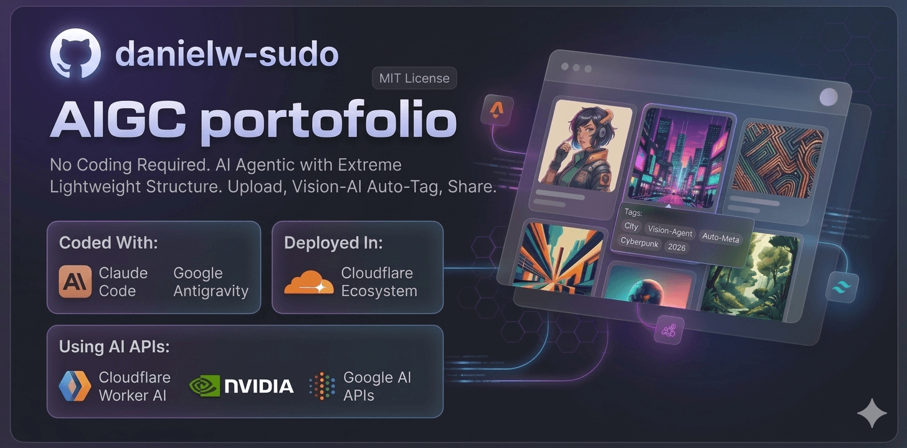
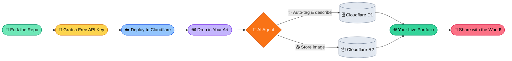

# 🚀 AIGC portofolio

---

## 🌐 Internationalization / 多语言支持 / 多言語対応

**[English](./README.md) | [中文说明](./README_ZH.md) | [日本語の説明](./README_JA.md)**

---

生産準備完了、**AI-Agentic** ベースのギャラリー＆ブログシステムです。**極めて軽量な構造**で、**Astro 5** と **Cloudflare Ecosystem** によって構築されています。

> [!IMPORTANT]
> **コーディング不要。** このプロジェクトは、ベンダーロックインされた重いパッケージを使わずに、高速な Agentic ワークフローを構築するために設計されています。デプロイは迅速で、使いやすく、無料で開始でき、さらなる拡張性も秘めています。リポジトリを Fork し、[デプロイガイド](./src/QuickStart/DEPLOY_WITH_AI.md) に従うだけで、数分でサイトを公開できます。

---

## 🧭 プロジェクトナビゲーション
* [**🎨 迅速なデプロイ**] — 5 分でサイトを公開。
* [**🛠️ サイトのカスタマイズ**] — AI Agent を設定し、カスタマイズします。
* [**💻 新機能の開発**] — Claude Code と Antigravity を使用して、拡張、変更、開発を行います。
* [**🔑 無料の API キーを取得**](./src/QuickStart/how-to-get-free-test-api.md) — サポートされているすべての AI プロバイダー向けの無料枠キーを使用して開始します。

---

## 🏗️ ワークフローの概要

_以下のタイトルをクリックして各セクションを表示します_

🚀 <b>AI を使用したデプロイ (ノーコード)</b>

### 「ノーコード」パス
このワークフローは、ターミナルやコードに触れることなく、プロフェッショナルなサイトを作成したいユーザー向けに設計されています。

1. **リポジトリを Fork**: 右上の「Fork」ボタンをクリックして、自身のプロジェクトのコピーを取得します。
2. **Cloudflare 連携**: GitHub アカウントを Cloudflare Pages に接続します。
3. **自動プロビジョニング**: Cloudflare が設定を検知し、データベース (D1) と画像ストレージ (R2) を自動的にセットアップします。
4. **公開**: サイトが公開されました！独自の URL にアクセスして、アートの共有を始めましょう。

*視覚的なステップバイステップのガイドについては、[**DEPLOY_WITH_AI.md**](./src/QuickStart/DEPLOY_WITH_AI.md) を参照してください。*

⚙️ <b>AI を使用したサイトの設定方法</b>

### サイトと AI「従業員」の管理
API キーと設定に慣れている場合は、AI の動作を微調整できます。

1. **API の選択**: ダッシュボードを使用して、画像分析用に **NVIDIA NIM**、**Google Gemini 3 Flash**、または **Cloudflare Worker AI** を切り替えます。
2. **システムプロンプト (Prompting)**: "Agent Vibe (Agent の雰囲気)" を調整して、説明の記述方法（「プロフェッショナル」、「詩的」、または「詳細な技術的」など）を変更します。
3. **ゼロトラストセキュリティ (Zero Trust Security)**: Cloudflare Access を使用して `/admin` エリアを保護し、あなただけがコンテンツを管理できるようにします。

*高度な構成については [**SETUP.md**](./src/QuickStart/SETUP.md) を、無料の API キーを取得するためのステップバイステップの手順については [**how-to-get-free-test-api.md**](./src/QuickStart/how-to-get-free-test-api.md) を参照してください。*

🛠️ <b>新機能の開発方法 (agentic coding)</b>

### 高速 Agent 開発
このリポジトリは、**Claude Code** および **Google Antigravity** 向けに事前設定された「クリーンな状態」のテンプレートです。

1. **AI 対応ワークスペース**: `.claude/` および `.antigravity/` ディレクトリが含まれています。これらには、AI がプロジェクトの構造を理解するために必要なコンテキストとルールが含まれています。
2. **シームレスな導入**: 
    * **Claude Code**: ルートディレクトリで `claude` を実行します。Agent は `CLAUDE.md` を読み込み、すぐにリファクタリングや機能追加を行う準備が整います。
    * **Antigravity**: `mission_control.json` を使用して、Astro 5 コードベース全体の複雑なタスクを管理します。
3. **2026 年向けに最適化**: Tailwind CSS 4 と Astro 5 で構築され、最新のコンテナクエリと CSS-next 機能を活用しています。

> [!NOTE]
> `.claude/` と `.antigravity/` フォルダは次のコミットで追加されます。

---

## 🛠️ 技術スタック (The Tech Stack)

| レイヤー | テクノロジー |
| :--- | :--- |
| **フレームワーク (Framework)** | Astro 5 (SSR) |
| **ランタイム (Runtime)** | Cloudflare Workers |
| **データベース (Database)** | Cloudflare D1 (Serverless SQLite) |
| **ストレージ (Storage)** | Cloudflare R2 (S3-compatible) |
| **AI Agents** | NVIDIA NIM + Google Gemini + CF Workers AI |
| **スタイリング (Styling)** | Tailwind CSS 4 |

---

## 🌍 使用、倫理、および規制

> [NOTICE]
> **責任ある AI の使用:** 無料利用枠のキーは、テストと開発には十分です。取得ガイドについては、[**how-to-get-free-test-api.md**](./src/QuickStart/how-to-get-free-test-api.md) を参照してください。長期的な本番環境用としては、より高いデータ品質、処理能力、および中断のないサービスを確保するために、有料の AI モデル API に移行することをお勧めします。
>
> **地域のコンプライアンス:**
> AI 規制（EU AI Act、中国の生成 AI 措置、カナダの AIDA など）は地域によって異なります。実装が、運用する管轄地域の現地の法律およびデータプライバシー規制に準拠していることを確認してください。フォークの運営者として、以下について責任を負う必要があります。
> 1. **透明性:** 訪問者に対して、AI で生成されたコンテンツを開示すること。
> 2. **データプライバシー:** 画像のメタデータに関して、Vision AI の使用が現地のプライバシー法に準拠していることを確認すること。
> 3. **利用の責任:** プラットフォームを通じて配信される AI 生成出力の正確性と倫理的影響に対する責任を維持すること。

---

## 📜 ライセンス (License)

このプロジェクトは **MIT License** の下でライセンスされています。詳細については、[LICENSE](https://github.com/danielw-sudo/AIGC-portfolio?tab=MIT-1-ov-file) を参照してください。

---
**Crafted with 🤖 AI Agents for the next generation of creators.**
