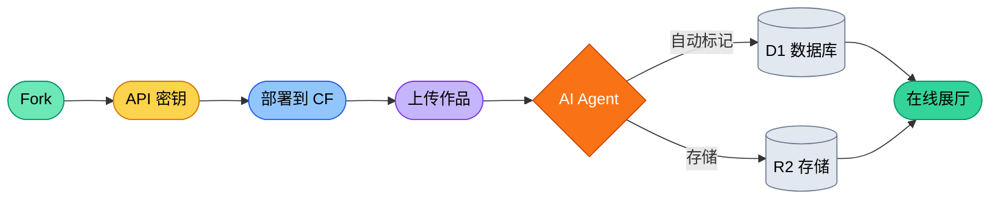

# AIGC Portfolio

**上传你的作品。让 AI 处理剩下的一切。零成本。**

**[English](./README.md) | [中文说明](./README_ZH.md) | [日本語の説明](./README_JA.md)**

---


生产就绪的 AI 艺术展厅与博客。9 个依赖。零供应商锁定。完全运行在 Cloudflare 免费套餐上。

> [!IMPORTANT]
> **无需代码。** Fork 本仓库，按照[部署指南](./src/QuickStart/DEPLOY_WITH_AI.md)操作，几分钟内即可上线。或使用 `bash setup.sh` 一键部署。

---

## 功能概览

- **展厅** — 上传作品，AI 自动使用视觉模型进行标记和描述
- **博客** — Markdown 编辑器，附带 AI 文案辅助
- **多 LLM 编排** — 在管理面板中切换 Cloudflare Workers AI、NVIDIA NIM 和 Google Gemini。无中间件、无 SDK — 通过字符串前缀路由的直接 API 调用
- **Butler** — 了解站点内容和状态的上下文感知 AI 助手
- **管理面板** — 完整的 CMS，包含站点配置、AI 设置、内容审计、使用量监控
- **Agent 开发** — 附带 `.claude/` 和 `.antigravity/` 上下文文件，AI 编程工具从第一条提示就能理解项目

---

## 工作流



---

## 三种使用方式

<details>
<summary><b>第一层：用 AI 部署（零代码）</b></summary>

Fork → 将 [DEPLOY_WITH_AI.md](./src/QuickStart/DEPLOY_WITH_AI.md) 中的提示粘贴到 Claude Code 或 Antigravity → 站点上线。

</details>

<details>
<summary><b>第二层：通过管理面板自定义</b></summary>

- 在管理面板中切换 AI 提供商和模型
- 编辑系统提示词以改变 AI 描述作品的方式
- 配置首页、导航、元数据
- 使用 Cloudflare Zero Trust 保护 `/admin`

详细配置请参阅 [SETUP.md](./src/QuickStart/SETUP-zh.md)。

</details>

<details>
<summary><b>第三层：使用 AI 编程工具构建</b></summary>

本仓库附带 Agent 上下文文件：

- **`.claude/CLAUDE.md`** — 在根目录运行 `claude`，Agent 即刻理解架构、约束和模式。
- **`.antigravity/rules.md`** — Gemini 等 AI 工具读取此文件获取项目上下文。

添加新的 AI 提供商约 80 行代码。代码库刻意保持可读性 — 200 行文件上限，零 React，纯 Astro 组件。

</details>

---

## 技术栈

| 层级 | 技术 |
| :--- | :--- |
| **框架** | Astro 6 (SSR) |
| **运行时** | Cloudflare Workers (边缘计算) |
| **数据库** | Cloudflare D1 (无服务器 SQLite) |
| **存储** | Cloudflare R2 (S3 兼容) |
| **AI** | CF Workers AI + NVIDIA NIM + Google Gemini |
| **样式** | Tailwind CSS 4 |
| **依赖** | 共 9 个（零 React、零 ORM、零 AI SDK） |

---

## 快速开始

```bash
git clone https://github.com/YOUR_USERNAME/AIGC-portfolio.git
cd AIGC-portfolio
bash setup.sh
```

详细说明请参阅 [SETUP.md](./src/QuickStart/SETUP-zh.md)，API 密钥获取指南请参阅 [how-to-get-free-test-api.md](./src/QuickStart/how-to-get-free-test-api.md)。

---

## 使用、道德与合规

> [!NOTE]
> **负责任的 AI 使用：** 免费密钥足以用于测试和个人使用。生产环境建议使用付费 API 以确保可靠性。
>
> **区域合规性：** AI 法规因地区而异。作为 Fork 的运营者，您有责任确保透明度、数据隐私及使用责任。

---

## 许可证

**MIT License** — 详情请参阅 [LICENSE](https://github.com/danielw-sudo/AIGC-portfolio?tab=MIT-1-ov-file)。

---

**用 AI Agent 为下一代创作者打造。**
