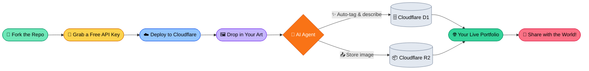

# 🚀 AIGC portofolio

---

## 🌐 Internationalization / 多语言支持 / 多言語対応

**[English](./README.md) | [中文说明](./README_ZH.md) | [日本語の説明](./README_JA.md)**

---

一个生产就绪、基于 **AI-Agentic** 的艺术馆与博客系统，拥有**极简架构**。基于 **Astro 5** 构建，并由 **Cloudflare Ecosystem** 驱动。

> [!IMPORTANT]
> **无需代码。** 本项目旨在构建快速的 Agentic 工作流，不依赖任何供应商锁定的重型软件包。部署快、易使用、零成本启动，且极具扩展潜力。Fork 本仓库，按照 [部署指南](./src/QuickStart/DEPLOY_WITH_AI.md) 操作，几分钟内即可上线您的网站。

---

## 🧭 项目导航
* [**🎨 快速部署**] — 5 分钟内上线您的网站。
* [**🛠️ 自定义您的网站**] — 配置和自定义您的 AI Agent。
* [**💻 开发新功能**] — 使用 Claude Code 和 Antigravity 进行扩展、修改和开发。
* [**🔑 获取免费的 API 密钥**](./src/QuickStart/how-to-get-free-test-api.md) — 为所有支持的 AI 提供商获取免费测试密钥以开始使用。

---

## 🏗️ 工作流概览

_点击以下标题查看各个部分_

🚀 <b>如何利用 AI 部署 (零代码)</b>

### “无代码”路径
此工作流专为希望拥有专业站点但不想接触终端或编写代码的用户设计。

1. **Fork 此仓库**: 点击右上角的 "Fork" 按钮，获取您自己的项目副本。
2. **Cloudflare 集成**: 将您的 GitHub 账户连接到 Cloudflare Pages。
3. **自动配置**: Cloudflare 将检测配置并自动设置您的数据库 (D1) 和图像存储 (R2)。
4. **正式上线**: 您的站点现已上线！访问您的唯一 URL，开始分享您的艺术作品。

*如需可视化的分步指南，请参阅 [**DEPLOY_WITH_AI.md**](./src/QuickStart/DEPLOY_WITH_AI.md)。*

⚙️ <b>如何使用 AI 设置您的网站</b>

### 管理您的网站与 AI “员工”
如果您熟悉 API 密钥和相关设置，您可以微调 AI 的工作方式：

1. **API 选择**: 使用仪表板在 **NVIDIA NIM**、**Google Gemini 3 Flash** 或 **Cloudflare Worker AI** 之间切换，进行图像分析。
2. **系统提示词 (Prompting)**: 调整 “Agent Vibe” (Agent氛围) 以改变生成描述的方式（例如，“专业”、“诗意” 或 “详细的技术说明”）。
3. **零信任安全 (Zero Trust Security)**: 使用 Cloudflare Access 保护您的 `/admin` 区域，以确保只有您可以管理内容。

*高级配置请参阅 [**SETUP.md**](./src/QuickStart/SETUP.md)，有关获取免费 API 密钥的分步说明，请参阅 [**how-to-get-free-test-api.md**](./src/QuickStart/how-to-get-free-test-api.md)。*

🛠️ <b>如何构建新功能 (agentic coding)</b>

### 高速 Agent 开发
此存储库是一个预配置了 **Claude Code** 和 **Google Antigravity** 的“干净模板”。

1. **AI 就绪的工作区**: 我们包含了 `.claude/` 和 `.antigravity/` 目录。这些目录包含 AI 理解项目结构所需的上下文和规则。
2. **无缝入门**: 
    * **Claude Code**: 在根目录下运行 `claude`。该 Agent 将读取您的 `CLAUDE.md` 并立即准备好用于重构或添加功能。
    * **Antigravity**: 使用 `mission_control.json` 来管理整个 Astro 5 代码库中的复杂任务。
3. **面向 2026 优化**: 使用 Tailwind CSS 4 和 Astro 5 构建，利用了最新的容器查询和 CSS-next 功能。

> [!NOTE]
> `.claude/` 和 `.antigravity/` 文件夹将在下一次提交中添加。

---

## 🛠️ 技术栈 (The Tech Stack)

| 层级 | 技术 |
| :--- | :--- |
| **框架 (Framework)** | Astro 5 (SSR) |
| **运行时 (Runtime)** | Cloudflare Workers |
| **数据库 (Database)** | Cloudflare D1 (Serverless SQLite) |
| **存储 (Storage)** | Cloudflare R2 (S3-compatible) |
| **AI Agents** | NVIDIA NIM + Google Gemini + CF Workers AI |
| **样式 (Styling)** | Tailwind CSS 4 |

---

## 🌍 使用、道德与合规

> [NOTICE]
> **负责任的 AI 使用:** 免费测试层的密钥足以用于测试和开发 — 有关获取指南，请参阅 [**how-to-get-free-test-api.md**](./src/QuickStart/how-to-get-free-test-api.md)。对于长期生产环境，我们建议过渡到付费的 AI 模型 API，以确保更高的数据质量、处理能力和不间断的服务。
>
> **区域合规性:**
> 针对 AI 的相关法规（如欧盟的 AI 法案、中国生成式人工智能服务管理暂行办法或加拿大的 AIDA）因地区而异。请确保您的部署符合您运营管辖区的当地法律和数据隐私法规。作为您 fork 版本的运营者，您有责任：
> 1. **透明度:** 向您的访客披露哪些内容是 AI 生成的。
> 2. **数据隐私:** 确保您使用视觉（Vision）AI 处理图像元数据符合当地隐私法。
> 3. **使用责任:** 对通过您的平台分发的 AI 生成输出的准确性和道德影响负责。

---

## 📜 许可证 (License)

本项目基于 **MIT License** 获得许可。 有关完整详细信息，请参阅 [LICENSE](https://github.com/danielw-sudo/AIGC-portfolio?tab=MIT-1-ov-file)。

---
**Crafted with 🤖 AI Agents for the next generation of creators.**
